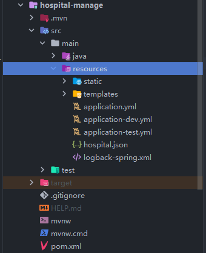

# 尚医通

### 环境

- JDK8、nacos、rabbitmq、redis、MongoDB、Mysql、oss.....

### 修改代码

- 一些配置文件中的数据库、redis密码...都需要修改成自己的

- 修改service-oss下面的application.yml配置文件如下：

- 修改service-msm下面的application.yml配置文件如下：

### 前端3个

    
    

### 效果图

